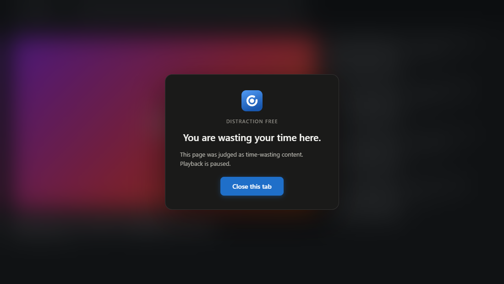
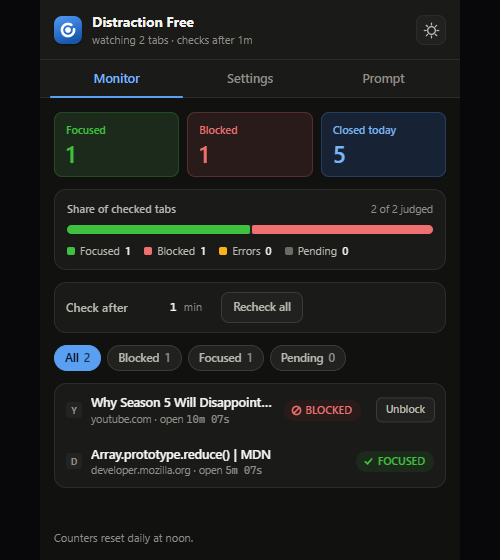
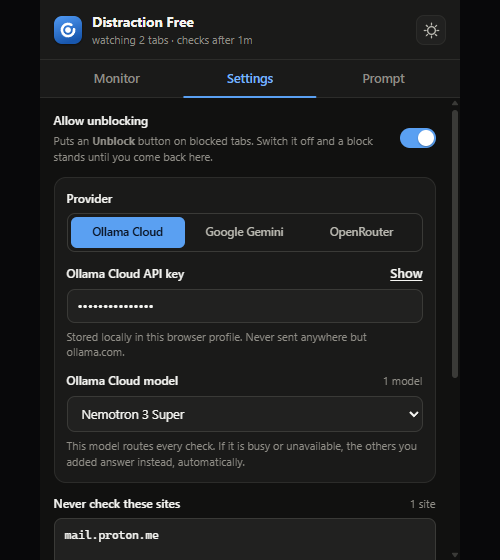
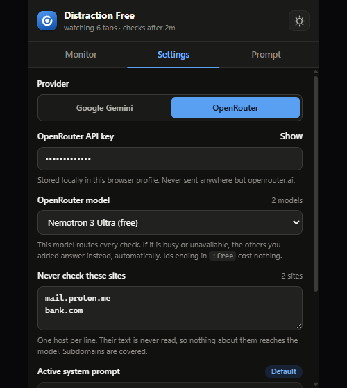
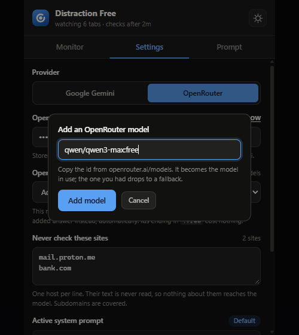
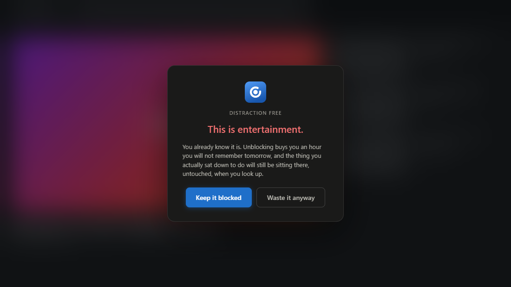
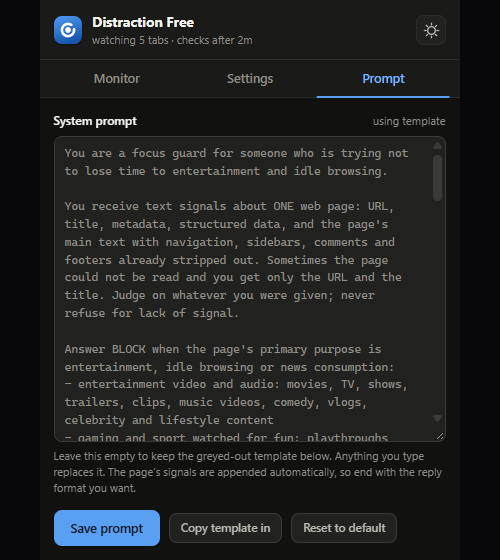

# Distraction Free

**You didn't open that tab to watch a 22-minute video about a show you don't even like.**

Distraction Free sits quietly in your browser, reads what's actually on the page, and asks an AI one blunt question: *is this entertainment, or is this something you actually need?* If it's the first one, it says so — right across the page, with the video paused.

No blocklists to maintain. No "ban youtube.com" — because half of YouTube is a conference talk and the other half is a rabbit hole. Distraction Free judges the **page**, not the domain.

---

## Why it's different

| Most blockers | Distraction Free |
| --- | --- |
| You maintain a list of banned sites | It reads the page and decides |
| YouTube is all-or-nothing | A Rust talk passes. A movie theory doesn't. |
| Blocks instantly, so you rage-disable it | Gives you a grace period — a minute by default |
| Overriding means disabling the whole thing | One click buys you an hour on that page |
| Sends your browsing to someone's server | Talks only to *your* AI key, and nothing else |

It's built for one person in particular: **an engineer who keeps ending up somewhere they didn't mean to go.** Trailers, drama, rankings, tech news, infinite feeds — not fine, however smart they sound. Everything else is your business: docs and GitHub and cloud consoles, obviously, but your bank, your shopping cart and your inbox too. It only goes after the things that eat afternoons.

---

## The dashboard

Click the icon and you see exactly where your attention went.

- **Focused / Blocked / Closed today** — the score. "Closed today" counts every distracting tab you actually shut.
- **Share of checked tabs** — one glance tells you what kind of session this has been.
- **Check after … min** — the grace period. Land on a page and you get this long before anything judges you. Change it here, it applies instantly.
- **Recheck all** — start the whole room over.
- **The tab list** — every open tab with its verdict: `FOCUSED`, `BLOCKED`, `UNBLOCKED`, `PRIVATE`, or a countdown. Click any row to jump straight to that tab.
- **Unblock** — on any blocked row. It's the escape hatch, and it argues back. See below.

Tabs sitting in the **background are left alone** until you actually switch to them — so a pile of unread tabs costs you nothing, and a tab you close without reading never costs anything at all.

---

## Install it in two minutes

Works in **Chrome** and **Edge**. There's no Web Store listing — you load it yourself, which takes about as long as reading this sentence.

1. **Download this folder** to somewhere permanent. Chrome loads the extension from this exact path, so don't run it out of `Downloads` and then clean up later — deleting the folder uninstalls it.
2. Open **`chrome://extensions`** (Edge: `edge://extensions`).
3. Flip **Developer mode** on — top-right corner.
4. Hit **Load unpacked** — top-left — and pick the folder you downloaded. Pick the folder *itself*, the one with `manifest.json` in it.
5. That's it. Click the puzzle-piece icon in the toolbar and **pin** Distraction Free so it's one click away.

> **Sharing it with someone?** On the same page, **Pack extension** turns the folder into a `.crx` file plus a `.pem` signing key. Keep the `.pem` safe and private — it's what proves future updates came from you. For your own machine, Load unpacked is simpler and updates the moment you change a file.

Nothing works until you add a key, so:

---

## Get your key

Distraction Free brings no AI of its own. You plug in your own key, and it talks to nothing else. Pick **one** provider — whichever you save is the one that gets used.

### Option A — Ollama Cloud *(frontier open models, run for you)*

1. Go to **[ollama.com](https://ollama.com)** and sign in.
2. Create an API key from your account settings.
3. In the extension: **Settings → Ollama Cloud**, paste, **Save settings**.

Ships with **Nemotron 3 Super** selected. Ollama ids are plain model names — no `vendor/` prefix — and you can add any other from [ollama.com/library](https://ollama.com/library).

### Option B — Google Gemini *(easiest)*

1. Go to **[aistudio.google.com/apikey](https://aistudio.google.com/apikey)**.
2. Sign in and click **Create API key**.
3. Copy it — it starts with `AIza…`.
4. In the extension: **Settings → Google Gemini**, paste, **Save settings**.

Google's free tier is generous, and a check costs a few hundred words of text. Most people never see a bill.

### Option C — OpenRouter *(hundreds of models, including free ones)*

1. Go to **[openrouter.ai/keys](https://openrouter.ai/keys)**.
2. Click **Create key** and copy it — it starts with `sk-or-v1-…`.
3. In the extension: **Settings → OpenRouter**, paste, **Save settings**.

Any model id ending in **`:free`** costs exactly nothing. Two of them ship ready to go.

> **Save settings doesn't just save.** It fires one real request at the model you picked and waits for the answer. A mistyped key or a retired model id is caught right there, instead of silently failing an hour later.

---

## What each screen does

### Settings — pick your brain

Three providers, one key, your choice: **Ollama Cloud**, **Google Gemini** or **OpenRouter**. Whichever you save is the one that answers every check — the others sit idle with their keys kept, so switching back later is one click. If your chosen model is busy or over quota, the next one in your list takes over automatically. You don't get an error, you get an answer.

**Never check these sites** is your privacy line. Anything listed here is never read, never sent, never judged. Your bank, your email, your company's internal tools. Subdomains are covered, so `bank.com` covers `login.bank.com`. These tabs show up as `PRIVATE` in the list, and that's all the extension will ever know about them.

### Models — route every check through any model you like

On Ollama Cloud and OpenRouter, the dropdown *is* your model list. Whatever's selected answers every check; everything else queues up behind it as a fallback for when that one's busy.

Both catalogues churn constantly, so the list isn't a closed menu — pick **Add another model…**, paste an id from [ollama.com/library](https://ollama.com/library) or [openrouter.ai/models](https://openrouter.ai/models), and it becomes the model in use. The one you were using drops down to a fallback.

Saving tests the id with a real request first, so a wrong one is caught right there rather than quietly failing every check for an hour.

### Unblock — for when it gets it wrong

It *will* get one wrong. A login page for your professional body, an invoice portal, a health form — something that looks like nothing much from its text alone. So every blocked row has an **Unblock** button, and it takes about a second.

Here's the part that matters: clicking it doesn't just open the gate. **It takes you to the page first**, reads what's actually on screen, and asks one narrow question — *is this really entertainment?* The card tells you it's looking, and then:

- **It isn't** → the page opens immediately. No dialog, no lecture. That invoice portal was never a distraction and you shouldn't have to argue about it.
- **It is** → you get told, to your face, on the page itself. And then it opens anyway if you say so. **Waste it anyway** is a real button, because a blocker you can't override is a blocker you uninstall.

Going to the tab first isn't ceremony. A tab you've never looked at has never been drawn, so there's often nothing on it to read — judging it from the popup would mean judging an empty page. And it puts the decision in front of the thing you're deciding about, which is harder to wave away than a dialog somewhere else.

An unblock is **a one-hour pass, not a permanent one**. For that hour the page is yours — refresh it, close the browser and come back, open it in another tab, change your settings: it stays open. When the hour is up it goes back in the queue and gets judged again, and if it's still a time sink it gets blocked again. A moment of "fine, I'll watch it" shouldn't quietly become a permanent hole in your own rules.

The pass is granted against the **exact URL**, query string and all. Excusing one video does not excuse YouTube, and does not even excuse the same video at a different timestamp.

> Need a whole site permanently exempt instead? That's the **never-check list** in Settings — stronger, because those pages are never even read.

Don't want the escape hatch at all? **Allow unblocking** sits at the top of Settings. Switch it off and the Unblock button disappears, so a block stands until you come back here and turn it on again. Pages you already unblocked stay unblocked.

### Prompt — make it judge *your* way

This is the good part. The rules aren't hard-coded — they're a prompt, and it's yours to rewrite.

The built-in one goes after entertainment and idle browsing: video and music, gaming and sport, reactions and rankings and ending-explained, social feeds and infinite scroll, and news of every kind — including tech and AI news, which is where most engineers actually lose their afternoons. Everything else passes: your bank, your shopping cart, your email, your docs, your cloud console. When it isn't sure, it lets you through.

Want shopping blocked too, because that's *your* time sink? Want the rules tightened to documentation only while you're on a deadline? Want news to stay open on Sunday mornings? Hit **Copy template in**, edit the rules in plain English, **Save prompt** — and every tab gets judged again under the new regime. **Reset to default** puts the original back.

---

## What actually happens, in plain terms

1. You land on a page. A timer starts — one minute by default, and you can set it anywhere from 1 to 120.
2. If you're still there when it ends, the extension reads the page's **text**: title, headings, description, and the main body with navigation, sidebars, forms and footers stripped out. **No screenshots. No keystrokes. No history.**
3. That text goes to your provider with your prompt, and comes back as one word: `ALLOW` or `BLOCK`.
4. `ALLOW` → the tab is marked **FOCUSED** and left alone for good.
5. `BLOCK` → video and audio pause, the page goes behind a blur, and you get one button: **Close this tab**.
6. Disagree? **Unblock** it from the popup. One more look at the page decides whether you get waved through or argued with first — and either way, you get the final say.

Every page is judged **once**. Navigate somewhere new and the clock starts fresh. Refreshing a blocked page doesn't get you past it, and doesn't cost another check. The daily score resets each day at noon.

---

## House rules

- **Your key is yours.** It's stored in your browser profile and sent to exactly one place: the provider you chose. There is no server in the middle, no account, no telemetry.
- **Pages on the never-check list are never read.** Not sent-and-ignored — never read in the first place.
- **Some pages can't be read at all.** Chrome won't let any extension read the Web Store, so those tabs show as `NO ACCESS` and are left alone. Browser pages like `chrome://settings` aren't tracked at all.
- **It can be wrong.** It's an AI making a judgement call on a page of text. If it's wrong often, don't fight it — rewrite the prompt. That's what it's there for.
- **Nothing is deleted or force-closed.** The only thing that closes your tab is you, clicking the button.
- **You always get the last word.** Every block can be overridden. The override lasts an hour, then the page is judged again like any other.

---

## Everyday questions

**Can I turn it off for a bit?** Bump **Check after** up to 120 minutes, or add the site to the never-check list. Or just don't click the button — the overlay is a stop sign, not a lock.

**It blocked something I actually needed.** Hit **Unblock** on that row. If it isn't entertainment, it opens straight away and stays open for the next hour. If it's a page you'll keep coming back to, or a whole site, put it on the never-check list instead — that's permanent, and those pages are never even read.

**Can I get past a block by refreshing?** No. The verdict is remembered against the page, so a reload puts the wall straight back up — without spending another check. Use **Unblock**; that's what it's for.

**Will it block my music?** A tab you're not looking at is never checked, so background music keeps playing. If you're actually *on* the tab, add the site to the never-check list.

**Does it slow my browsing down?** No. It reads a page once, about a minute after you land on it, and only for tabs you're actually looking at.

**Do I need to keep the folder?** Yes — Chrome loads the extension from that path every time it starts.

---

*Built for people who know exactly what they should be working on.*
